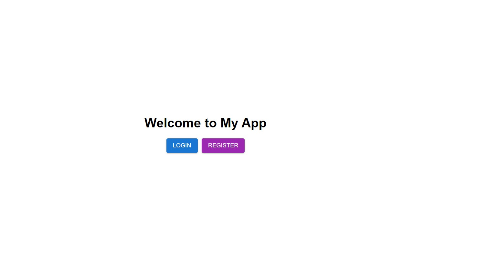
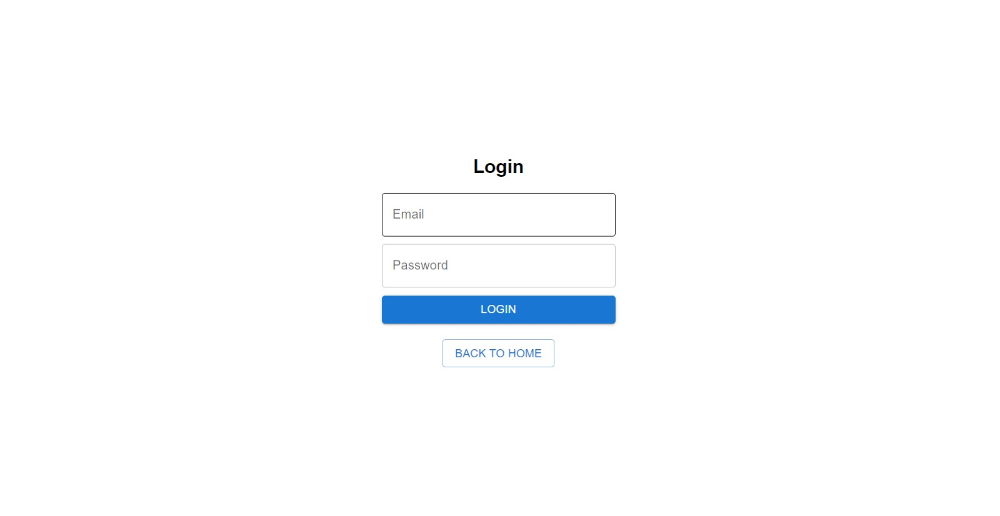
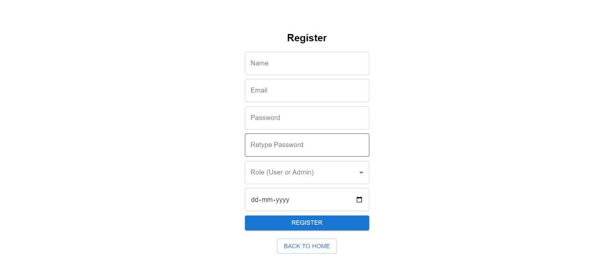
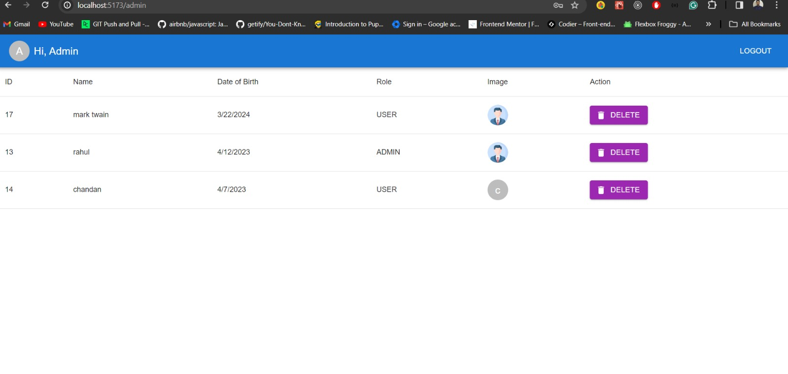
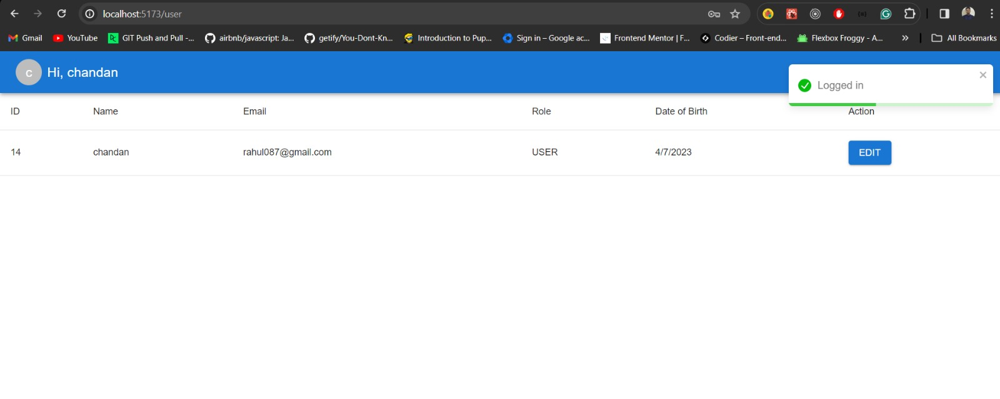

# Full-Stack CRUD APP

## About

I have divided the folder structure in two section frontend and backend. Frontend involves Login and Registration on Landing Page. Registration has two user role Admin and User. Admin has the authority of viewing all the users present in database and role of deleting the users. User can only update it's profile and view it's own info.

- Backend Work flow
  - Created Schema for User model in Prisma
  - Auth Controller for Handling login and registration.
  - Making use of JWt for encrypting payload and generating token for further validation
  - Added auth middleware for all api like getUser, getAlluser, delete, update
  - Admin has only access to delete the user data hence added role middleware for that
  - Update can be done by both user and admin
  - Added file uploader for user's profile
  - Have added validation for all schema using vine.js library

- Frontend Work flow
  - Main App folder contains all the components
  - Home, Login, Registration, User, Admin, Not Found
  - Restricted Protected Route for User and Admin
  - Stored Jwt token after login in localstorage for restricted API with authorization
  - Destroyed token after logout 

## Core Structure

    fsja
      ├── backend
      │   ├── Prisma
      │   │   > Shcema.prisma
      │   │
      │   ├── Controllers
      │   │   > auth.controller.js
      │   │   > user.controller.js
      │   │
      │   ├── Routes
      │   │   > api.routes.js
      │   │
      │   ├── Middleware
      │   │   > auth.middleware.js
      │   │   > role.middleware.js
      │   │
      │   ├── config
      │   │   > db.config.js
      │   │
      │   ├── validations
      │   │   > customErrorReporter.js
      │   │   > uservalidation.js
      │   │
      │   └── utils
      │       > fileUploadLimit.js
      │ 
      │
      ├── frontend
      │   │   > App.jsx
      │   │  
      │   ├── Components
      │   │   > Home Page
      │   │   > Login 
      │   │   > Registration
      │   │   > User Page -- Protected routes
      │   │   > Admin Page -- Protected routes
      │   │   > Not found Page
      │   
      ├── Assets -- Contains Image of frontend UI
      │
      ├── API Collection in thunder client
      │    
      └── README.md (you are here)

## Stack

### Backend

- API
  - NodeJS
  - Express
- Database
  - MySql
- ORM
  - Prisma
- Validation
  - Vine.js
  - Jwt
  - Bcrypt.js
- File Upload
  - Express-file-upload
- CORS setup

### Frontend

- Frontend
  - React
  - vite
  - React Router
  - Material UI
  - React-toastify

## Setup and Running

- Clone repository `git clone -b main https://github.com/Gmishra2000/fullstack-crud-app`

- **Backend**

  - Switch to `backend` directory `cd backend/`
  - Configuration
    - Create local environment file `.env` taking referenced from `.env-example`
    - Install packages using `npm i`
  - Run
    - Start API server: `npm start` (http://localhost:8000)

- **Frontend**

  - Switch to `frontend` directory `cd frontend/`
  - Configuration
    - Modify `environment.js` for
    - Change API Base Url if you have backend running on other PORT
  - Setup
    - Install dependencies: `npm install`
  - Run
    - Start Web server: `npm start`, browse at http://localhost:5173

## Screenshots

View all screenshots [here].

<table>
  <tbody>
    <tr>
      <td>
        
      </td>
      <td>
        
      </td>
    </tr>
    <tr>
      <td colspan="2">Web</td>
    </tr>
    <tr>
      <td>
        
      </td>
      <td>
        
      </td>
    </tr>
    <tr>
      <td colspan="2">web</td>
    </tr>
    <tr>
      <td>
        
      </td>
    
    </tr>
  </tbody>
</table>

## Authors

- Chandan Mishra - [GitHub](https://github.com/Gmishra2000) )
